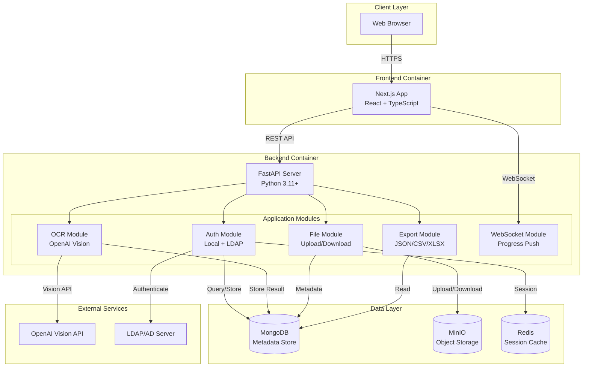

# 整合性架構與設計文件 (Unified Architecture & Design Document) - Smart OCR SaaS

---

**文件版本 (Document Version):** `v1.0`
**最後更新 (Last Updated):** `2025-12-24`
**主要作者 (Lead Author):** `技術架構團隊`
**審核者 (Reviewers):** `核心開發團隊`
**狀態 (Status):** `草稿 (Draft)`

---

## 目錄 (Table of Contents)

- [第 1 部分：架構總覽 (Architecture Overview)](#第-1-部分架構總覽-architecture-overview)
- [第 2 部分：需求摘要 (Requirements Summary)](#第-2-部分需求摘要-requirements-summary)
- [第 3 部分：高層次架構設計 (High-Level Architectural Design)](#第-3-部分高層次架構設計-high-level-architectural-design)
- [第 4 部分：技術選型詳述 (Technology Stack Details)](#第-4-部分技術選型詳述-technology-stack-details)
- [第 5 部分：資料架構 (Data Architecture)](#第-5-部分資料架構-data-architecture)
- [第 6 部分：部署與基礎設施架構 (Deployment and Infrastructure)](#第-6-部分部署與基礎設施架構-deployment-and-infrastructure)
- [第 7 部分：跨領域考量 (Cross-Cutting Concerns)](#第-7-部分跨領域考量-cross-cutting-concerns)
- [第 8 部分：模組詳細設計 (Module Detailed Design)](#第-8-部分模組詳細設計-module-detailed-design)
- [第 9 部分：風險與緩解策略 (Risks and Mitigation)](#第-9-部分風險與緩解策略-risks-and-mitigation)
- [第 10 部分：架構演進路線圖 (Architecture Evolution Roadmap)](#第-10-部分架構演進路線圖-architecture-evolution-roadmap)

---

**目的**: 本文件旨在將 Smart OCR SaaS 的業務需求轉化為一個完整、內聚的技術藍圖。從高層次的系統架構開始，逐步深入到具體的模組級實現細節，確保系統的穩固性與可維護性。

**相關文件**: [Smart OCR SaaS PRD](./smart_ocr_saas_prd.md)

---

## 第 1 部分：架構總覽 (Architecture Overview)

### 1.1 系統情境圖 (System Context Diagram)

```
┌─────────────────────────────────────────────────────────────────────────────┐
│                              外部系統 (External Systems)                      │
│  ┌───────────────┐    ┌───────────────┐    ┌───────────────┐                │
│  │   OpenAI      │    │   LDAP/AD     │    │   Email       │                │
│  │   Vision API  │    │   Server      │    │   Service     │                │
│  └───────────────┘    └───────────────┘    └───────────────┘                │
└─────────────────────────────────────────────────────────────────────────────┘
                                    │
                                    ▼
┌─────────────────────────────────────────────────────────────────────────────┐
│                                                                              │
│                        Smart OCR SaaS System                                 │
│                                                                              │
│   ┌─────────────────────────────────────────────────────────────────────┐   │
│   │                      Frontend (Next.js)                              │   │
│   │   - 使用者介面                                                        │   │
│   │   - 檔案上傳                                                          │   │
│   │   - 結果展示與編輯                                                     │   │
│   └─────────────────────────────────────────────────────────────────────┘   │
│                                    │                                         │
│                          REST API + WebSocket                                │
│                                    ▼                                         │
│   ┌─────────────────────────────────────────────────────────────────────┐   │
│   │                      Backend (FastAPI)                               │   │
│   │   - 認證服務 (Local + LDAP)                                           │   │
│   │   - OCR 處理服務                                                      │   │
│   │   - 檔案管理服務                                                       │   │
│   │   - 匯出服務                                                          │   │
│   └─────────────────────────────────────────────────────────────────────┘   │
│                                    │                                         │
│              ┌─────────────────────┼─────────────────────┐                  │
│              ▼                     ▼                     ▼                  │
│   ┌───────────────┐     ┌───────────────┐     ┌───────────────┐            │
│   │   MongoDB     │     │    MinIO      │     │    Redis      │            │
│   │  (Metadata)   │     │   (Files)     │     │   (Cache)     │            │
│   └───────────────┘     └───────────────┘     └───────────────┘            │
│                                                                              │
└─────────────────────────────────────────────────────────────────────────────┘
                                    ▲
                                    │
┌─────────────────────────────────────────────────────────────────────────────┐
│                              使用者 (Users)                                   │
│  ┌───────────────┐    ┌───────────────┐    ┌───────────────┐                │
│  │   一般使用者    │    │   企業使用者    │    │   系統管理員    │                │
│  │  (本地帳號)     │    │  (LDAP/AD)     │    │               │                │
│  └───────────────┘    └───────────────┘    └───────────────┘                │
└─────────────────────────────────────────────────────────────────────────────┘
```

### 1.2 通用語言 (Ubiquitous Language)

| 術語 | 定義 |
|:-----|:-----|
| **OCR Task** | 一次 OCR 處理任務，包含上傳的檔案及其處理狀態 |
| **OCR Result** | 單一頁面或圖片的辨識結果，包含文字內容和結構化資料 |
| **Local User** | 使用本地帳號密碼登入的使用者 |
| **LDAP User** | 透過企業 LDAP/AD 認證登入的使用者 |
| **Processing Progress** | OCR 處理的即時進度，透過 WebSocket 推送 |
| **Export Format** | 辨識結果的匯出格式 (JSON, CSV, XLSX) |
| **File Storage** | MinIO 物件儲存，用於存放上傳的圖片和 PDF |

### 1.3 Clean Architecture 分層

```
┌─────────────────────────────────────────────────────────────────┐
│                    Presentation Layer                            │
│              (Next.js Frontend, FastAPI Routes)                  │
├─────────────────────────────────────────────────────────────────┤
│                    Application Layer                             │
│         (Use Cases: AuthService, OCRService, ExportService)      │
├─────────────────────────────────────────────────────────────────┤
│                      Domain Layer                                │
│            (Entities: User, OCRTask, OCRResult)                  │
├─────────────────────────────────────────────────────────────────┤
│                   Infrastructure Layer                           │
│    (MongoDB Repository, MinIO Client, OpenAI Client, LDAP)       │
└─────────────────────────────────────────────────────────────────┘
```

**分層職責：**

| 層級 | 職責 | 範例 |
|:-----|:-----|:-----|
| **Presentation** | 處理 HTTP 請求/回應、WebSocket 連線 | FastAPI Router, Next.js Pages |
| **Application** | 協調業務流程、實現用例 | `process_ocr()`, `authenticate_user()` |
| **Domain** | 核心業務邏輯與實體 | User, OCRTask, OCRResult entities |
| **Infrastructure** | 外部服務整合、資料存取 | MongoDBRepository, MinIOClient |

---

## 第 2 部分：需求摘要 (Requirements Summary)

### 2.1 功能性需求摘要

| 功能模組 | 描述 | 對應 User Stories |
|:---------|:-----|:-----------------|
| **FR-1: 認證系統** | 本地帳號登入 + LDAP/AD 企業登入 | US-101, US-102 |
| **FR-2: 使用者管理** | 管理員可新增/編輯/停用使用者 | US-103 |
| **FR-3: 檔案上傳** | 支援圖片 (JPG/PNG/WEBP) 和 PDF 上傳 | US-201, US-202, US-203 |
| **FR-4: OCR 辨識** | 串接 OpenAI Vision API 進行辨識 | US-204, US-205 |
| **FR-5: 即時進度** | WebSocket 推送處理進度 | US-204 |
| **FR-6: 結果匯出** | 支援 JSON, CSV, XLSX 格式匯出 | US-301, US-302, US-303 |
| **FR-7: 歷史管理** | 查看/刪除辨識歷史紀錄 | US-401, US-402 |

### 2.2 非功能性需求 (NFRs)

| NFR 分類 | 具體需求描述 | 衡量指標/目標值 |
|:---------|:-------------|:----------------|
| **性能 (Performance)** | 單張圖片 OCR 處理時間 | < 5 秒 |
| | API 端點 P95 延遲 | < 500ms (不含 OCR) |
| **可用性 (Availability)** | 核心服務可用率 | > 99% |
| **可靠性 (Reliability)** | 檔案上傳成功率 | > 99.9% |
| **安全性 (Security)** | 資料傳輸加密 | TLS 1.2+ |
| | 密碼儲存 | bcrypt 雜湊 |
| | LDAP 連線 | 支援 LDAPS |
| **可擴展性 (Scalability)** | 並發使用者數 | 支援 100+ 同時在線 |
| **即時性 (Real-time)** | WebSocket 訊息延遲 | < 100ms |

---

## 第 3 部分：高層次架構設計 (High-Level Architectural Design)

### 3.1 選定的架構模式

**模式:** 前後端分離 + 模組化單體 (Modular Monolith)

**選擇理由:**
1. **前後端分離**: Next.js 與 FastAPI 各司其職，便於獨立開發與部署
2. **模組化單體**: 相較微服務，降低初期開發與運維複雜度，待業務成長後再拆分
3. **事件驅動 (WebSocket)**: 提供即時進度推送，提升使用者體驗

### 3.2 系統容器圖 (Container Diagram)



### 3.3 主要組件職責

| 組件/模組 | 核心職責 | 主要技術 | 依賴 |
|:----------|:---------|:---------|:-----|
| **Next.js Frontend** | 使用者介面、檔案上傳、結果展示 | React, TypeScript, TailwindCSS | FastAPI Backend |
| **Auth Module** | 本地/LDAP 認證、JWT 管理、使用者 CRUD | python-ldap, PyJWT | MongoDB, LDAP Server |
| **OCR Module** | 檔案處理、OpenAI API 呼叫、結果解析 | openai, PyMuPDF | OpenAI API, MinIO |
| **File Module** | 檔案上傳/下載、MinIO 整合 | boto3 (S3 API) | MinIO |
| **Export Module** | 多格式匯出 (JSON/CSV/XLSX) | openpyxl, pandas | MongoDB |
| **WebSocket Module** | 即時進度推送、連線管理 | FastAPI WebSocket | Redis (Pub/Sub) |

### 3.4 關鍵用戶旅程

#### 旅程 1: 使用者登入 (本地帳號)

```
1. 使用者 → 輸入帳號密碼 → Next.js
2. Next.js → POST /api/v1/auth/login → FastAPI
3. FastAPI/AuthModule → 驗證密碼 (bcrypt) → MongoDB
4. FastAPI/AuthModule → 產生 JWT Token
5. FastAPI → 回傳 Token (HTTP-only Cookie) → Next.js
6. Next.js → 導向儀表板
```

#### 旅程 2: 使用者登入 (LDAP/AD)

```
1. 使用者 → 選擇 LDAP 登入 → 輸入帳號密碼 → Next.js
2. Next.js → POST /api/v1/auth/login/ldap → FastAPI
3. FastAPI/AuthModule → LDAP Bind 驗證 → LDAP Server
4. 驗證成功 → 同步/建立使用者資料 → MongoDB
5. FastAPI/AuthModule → 產生 JWT Token
6. FastAPI → 回傳 Token → Next.js
7. Next.js → 導向儀表板
```

#### 旅程 3: 上傳圖片並執行 OCR

```
1. 使用者 → 拖放圖片上傳 → Next.js
2. Next.js → 建立 WebSocket 連線 → FastAPI/WSModule
3. Next.js → POST /api/v1/ocr/upload (multipart) → FastAPI
4. FastAPI/FileModule → 儲存檔案 → MinIO
5. FastAPI/FileModule → 建立 OCR Task → MongoDB
6. FastAPI → 回傳 Task ID → Next.js
7. Next.js → POST /api/v1/ocr/process/{task_id} → FastAPI
8. FastAPI/OCRModule → 讀取檔案 → MinIO
9. FastAPI/OCRModule → 呼叫 Vision API → OpenAI
10. FastAPI/WSModule → 推送進度 (10%, 50%, 100%) → Next.js (WebSocket)
11. FastAPI/OCRModule → 儲存結果 → MongoDB
12. FastAPI → 回傳辨識結果 → Next.js
13. Next.js → 顯示結果給使用者
```

#### 旅程 4: 匯出辨識結果

```
1. 使用者 → 選擇匯出格式 (XLSX) → Next.js
2. Next.js → GET /api/v1/export/{result_id}?format=xlsx → FastAPI
3. FastAPI/ExportModule → 讀取辨識結果 → MongoDB
4. FastAPI/ExportModule → 產生 XLSX 檔案
5. FastAPI → 回傳檔案 (Content-Disposition: attachment) → Next.js
6. 瀏覽器 → 下載檔案
```

---

## 第 4 部分：技術選型詳述 (Technology Stack Details)

### 4.1 技術選型原則

1. **優先選擇成熟穩定的技術**: 選用有活躍社群支持的開源方案
2. **可自建部署**: 支援本地/私有雲部署，資料主權可控
3. **開發效率優先**: 選擇團隊熟悉且 DX 良好的工具
4. **成本控制**: 優先使用開源方案，降低授權成本

### 4.2 技術棧詳情

| 分類 | 選用技術 | 版本 | 選擇理由 | 備選方案 |
|:-----|:---------|:-----|:---------|:---------|
| **前端框架** | Next.js | 14+ | App Router、SSR/SSG、React 生態系 | Nuxt.js, Remix |
| **前端 UI** | TailwindCSS + shadcn/ui | 3.x | 快速開發、一致性設計 | MUI, Ant Design |
| **前端狀態** | Zustand | 4.x | 輕量、簡潔 API | Redux, Jotai |
| **後端框架** | FastAPI | 0.100+ | 高性能、自動 OpenAPI 文件、原生 async | Flask, Django |
| **後端語言** | Python | 3.11+ | AI 生態系豐富、快速開發 | Node.js, Go |
| **資料庫** | MongoDB | 7.x | 文件型、Schema 彈性、適合非結構化資料 | PostgreSQL |
| **物件儲存** | MinIO | Latest | S3 相容、可自建、高性能 | AWS S3, Cloudinary |
| **快取** | Redis | 7.x | Session 管理、WebSocket Pub/Sub | Memcached |
| **認證** | JWT + HTTP-only Cookie | - | 無狀態、安全、前後端分離友好 | Session-based |
| **LDAP 客戶端** | python-ldap | 3.x | 成熟穩定、支援 LDAPS | ldap3 |
| **PDF 處理** | PyMuPDF (fitz) | 1.23+ | 高效能、純 Python | pdf2image, pdfplumber |
| **Excel 處理** | openpyxl | 3.x | 原生 xlsx 支援、輕量 | pandas + xlsxwriter |
| **AI 服務** | OpenAI Vision API | GPT-4V | 強大的多模態能力、無需本地 GPU | Claude Vision, Gemini |
| **WebSocket** | FastAPI WebSocket | - | 原生支援、與 FastAPI 整合 | Socket.IO |
| **容器化** | Docker + Docker Compose | - | 標準化部署、開發環境一致性 | Podman |

### 4.3 前端專案結構

```
frontend/
├── app/                      # Next.js App Router
│   ├── (auth)/               # 認證相關頁面群組
│   │   ├── login/
│   │   └── logout/
│   ├── (dashboard)/          # 主功能頁面群組
│   │   ├── upload/
│   │   ├── history/
│   │   ├── results/[id]/
│   │   └── admin/users/
│   ├── api/                  # API Routes (BFF)
│   └── layout.tsx
├── components/
│   ├── ui/                   # shadcn/ui 元件
│   ├── forms/                # 表單元件
│   ├── upload/               # 上傳元件
│   └── results/              # 結果展示元件
├── hooks/
│   ├── useAuth.ts
│   ├── useWebSocket.ts
│   └── useOCR.ts
├── lib/
│   ├── api-client.ts         # API 呼叫封裝
│   └── utils.ts
├── stores/
│   └── authStore.ts          # Zustand store
└── types/
    └── index.ts              # TypeScript 型別定義
```

### 4.4 後端專案結構

```
backend/
├── app/
│   ├── main.py               # FastAPI 入口
│   ├── config.py             # 設定管理
│   ├── dependencies.py       # 依賴注入
│   │
│   ├── api/
│   │   └── v1/
│   │       ├── routes/
│   │       │   ├── auth.py
│   │       │   ├── admin.py
│   │       │   ├── ocr.py
│   │       │   ├── export.py
│   │       │   ├── history.py
│   │       │   └── websocket.py
│   │       └── router.py
│   │
│   ├── core/
│   │   ├── security.py       # JWT, Password hashing
│   │   └── exceptions.py     # 自定義例外
│   │
│   ├── models/               # Pydantic Models (DTOs)
│   │   ├── user.py
│   │   ├── ocr.py
│   │   └── export.py
│   │
│   ├── schemas/              # MongoDB Document Schemas
│   │   ├── user.py
│   │   ├── ocr_task.py
│   │   └── ocr_result.py
│   │
│   ├── services/             # Business Logic
│   │   ├── auth_service.py
│   │   ├── ldap_service.py
│   │   ├── ocr_service.py
│   │   ├── file_service.py
│   │   ├── export_service.py
│   │   └── websocket_service.py
│   │
│   └── repositories/         # Data Access Layer
│       ├── user_repository.py
│       ├── ocr_task_repository.py
│       └── ocr_result_repository.py
│
├── tests/
│   ├── unit/
│   └── integration/
│
├── requirements.txt
├── Dockerfile
└── docker-compose.yml
```

---

## 第 5 部分：資料架構 (Data Architecture)

### 5.1 MongoDB Collections 設計

#### users Collection

```javascript
{
  _id: ObjectId,
  username: String,              // 登入帳號 (unique)
  password_hash: String | null,  // bcrypt hash (LDAP 用戶為 null)
  display_name: String,
  email: String | null,
  auth_type: "local" | "ldap",
  ldap_dn: String | null,        // LDAP 用戶的 DN
  role: "admin" | "user",
  is_active: Boolean,
  created_at: ISODate,
  updated_at: ISODate,
  last_login: ISODate | null,
  usage: {
    monthly_count: Number,
    last_reset: ISODate
  }
}

// Indexes
{ username: 1 }  // unique
{ auth_type: 1, is_active: 1 }
```

#### ocr_tasks Collection

```javascript
{
  _id: ObjectId,
  user_id: ObjectId,             // ref: users._id
  original_filename: String,
  file_type: "image" | "pdf",
  file_size: Number,             // bytes
  minio_bucket: String,
  minio_object_key: String,
  page_count: Number,            // 圖片=1, PDF=實際頁數
  status: "uploaded" | "processing" | "completed" | "failed",
  progress: Number,              // 0-100
  error_message: String | null,
  created_at: ISODate,
  updated_at: ISODate
}

// Indexes
{ user_id: 1, created_at: -1 }
{ status: 1 }
```

#### ocr_results Collection

```javascript
{
  _id: ObjectId,
  task_id: ObjectId,             // ref: ocr_tasks._id
  user_id: ObjectId,             // ref: users._id (冗餘，便於查詢)
  page_number: Number,           // 頁碼 (從 1 開始)
  extracted_text: String,        // 辨識出的純文字
  structured_data: {             // OpenAI 解析的結構化資料
    type: String,                // 文件類型推測
    fields: [
      { key: String, value: String, confidence: Number }
    ],
    tables: [
      { headers: [String], rows: [[String]] }
    ]
  },
  confidence: Number,            // 整體信心度 0-1
  created_at: ISODate,
  updated_at: ISODate
}

// Indexes
{ task_id: 1, page_number: 1 }
{ user_id: 1, created_at: -1 }
```

#### ldap_config Collection (單一文件)

```javascript
{
  _id: ObjectId,
  server_url: String,            // ldap://ldap.example.com:389
  use_ssl: Boolean,
  base_dn: String,
  bind_dn: String,
  bind_password_encrypted: String,  // AES 加密
  user_search_filter: String,    // e.g., "(sAMAccountName={username})"
  username_attribute: String,    // e.g., "sAMAccountName"
  display_name_attribute: String, // e.g., "displayName"
  email_attribute: String,       // e.g., "mail"
  is_active: Boolean,
  created_at: ISODate,
  updated_at: ISODate
}
```

### 5.2 MinIO 儲存結構

```
ocr-uploads/                    # Bucket
├── {user_id}/
│   ├── {task_id}/
│   │   ├── original.{ext}      # 原始上傳檔案
│   │   ├── page_1.png          # PDF 轉換後的圖片
│   │   ├── page_2.png
│   │   └── ...
```

### 5.3 資料流圖 (Data Flow)

```
┌─────────────┐     ┌─────────────┐     ┌─────────────┐
│   使用者     │────▶│   Next.js   │────▶│   FastAPI   │
│  上傳檔案   │     │   Frontend  │     │   Backend   │
└─────────────┘     └─────────────┘     └──────┬──────┘
                                               │
                    ┌──────────────────────────┼──────────────────────────┐
                    │                          │                          │
                    ▼                          ▼                          ▼
            ┌─────────────┐            ┌─────────────┐            ┌─────────────┐
            │    MinIO    │            │   MongoDB   │            │   OpenAI    │
            │  儲存檔案    │            │  儲存 Task   │            │  Vision API │
            └─────────────┘            └─────────────┘            └──────┬──────┘
                    │                          │                          │
                    │                          │                  辨識結果 │
                    │                          │◀─────────────────────────┘
                    │                          │
                    │                   ┌──────▼──────┐
                    │                   │   MongoDB   │
                    │                   │ 儲存 Result  │
                    │                   └─────────────┘
                    │                          │
                    └──────────────────────────┼──────────────────────────┐
                                               │                          │
                                               ▼                          ▼
                                       ┌─────────────┐            ┌─────────────┐
                                       │   FastAPI   │            │   Next.js   │
                                       │  匯出服務    │────────────▶│  下載檔案   │
                                       └─────────────┘            └─────────────┘
```

---

## 第 6 部分：部署與基礎設施架構 (Deployment and Infrastructure)

### 6.1 Docker Compose 開發環境

```yaml
version: '3.8'

services:
  frontend:
    build: ./frontend
    ports:
      - "3000:3000"
    environment:
      - NEXT_PUBLIC_API_URL=http://localhost:8000
    depends_on:
      - backend

  backend:
    build: ./backend
    ports:
      - "8000:8000"
    environment:
      - MONGODB_URL=mongodb://mongodb:27017/ocr_saas
      - MINIO_ENDPOINT=minio:9000
      - MINIO_ACCESS_KEY=minioadmin
      - MINIO_SECRET_KEY=minioadmin
      - REDIS_URL=redis://redis:6379
      - OPENAI_API_KEY=${OPENAI_API_KEY}
    depends_on:
      - mongodb
      - minio
      - redis

  mongodb:
    image: mongo:7
    ports:
      - "27017:27017"
    volumes:
      - mongodb_data:/data/db

  minio:
    image: minio/minio
    ports:
      - "9000:9000"
      - "9001:9001"
    environment:
      - MINIO_ROOT_USER=minioadmin
      - MINIO_ROOT_PASSWORD=minioadmin
    command: server /data --console-address ":9001"
    volumes:
      - minio_data:/data

  redis:
    image: redis:7-alpine
    ports:
      - "6379:6379"

volumes:
  mongodb_data:
  minio_data:
```

### 6.2 部署視圖

```
┌─────────────────────────────────────────────────────────────────────────────┐
│                            Production Environment                            │
├─────────────────────────────────────────────────────────────────────────────┤
│                                                                              │
│   ┌───────────────┐                                                         │
│   │   CDN/Proxy   │  (Nginx / Cloudflare)                                   │
│   │   SSL 終止    │                                                         │
│   └───────┬───────┘                                                         │
│           │                                                                  │
│   ┌───────┴───────┐                                                         │
│   │               │                                                         │
│   ▼               ▼                                                         │
│ ┌─────────────┐ ┌─────────────┐                                             │
│ │  Frontend   │ │  Backend    │                                             │
│ │  Container  │ │  Container  │  x N (可水平擴展)                            │
│ │  (Next.js)  │ │  (FastAPI)  │                                             │
│ └─────────────┘ └──────┬──────┘                                             │
│                        │                                                     │
│         ┌──────────────┼──────────────┬──────────────┐                      │
│         │              │              │              │                      │
│         ▼              ▼              ▼              ▼                      │
│   ┌───────────┐  ┌───────────┐  ┌───────────┐  ┌───────────┐               │
│   │  MongoDB  │  │   MinIO   │  │   Redis   │  │  LDAP/AD  │               │
│   │  Cluster  │  │  Cluster  │  │  Cluster  │  │  Server   │               │
│   └───────────┘  └───────────┘  └───────────┘  └───────────┘               │
│                                                                              │
└─────────────────────────────────────────────────────────────────────────────┘
```

### 6.3 環境策略

| 環境 | 用途 | 基礎設施 |
|:-----|:-----|:---------|
| **Development** | 本地開發 | Docker Compose (單節點) |
| **Staging** | 整合測試、UAT | 單機部署或小型叢集 |
| **Production** | 正式環境 | 高可用叢集部署 |

### 6.4 CI/CD 流程

```
┌─────────┐    ┌─────────┐    ┌─────────┐    ┌─────────┐    ┌─────────┐
│  Push   │───▶│  Lint   │───▶│  Test   │───▶│  Build  │───▶│ Deploy  │
│  Code   │    │  Check  │    │  Suite  │    │  Image  │    │  Env    │
└─────────┘    └─────────┘    └─────────┘    └─────────┘    └─────────┘
                                                                  │
                                             ┌────────────────────┼────────────────────┐
                                             │                    │                    │
                                             ▼                    ▼                    ▼
                                       ┌───────────┐       ┌───────────┐       ┌───────────┐
                                       │   Dev     │       │  Staging  │       │   Prod    │
                                       │  (auto)   │       │ (manual)  │       │ (manual)  │
                                       └───────────┘       └───────────┘       └───────────┘
```

---

## 第 7 部分：跨領域考量 (Cross-Cutting Concerns)

### 7.1 認證與授權

#### JWT Token 結構

```json
{
  "sub": "user_id",
  "username": "john.doe",
  "role": "user",
  "auth_type": "local",
  "exp": 1735084800,
  "iat": 1735041600
}
```

#### 授權矩陣

| 端點 | 一般使用者 | 管理員 |
|:-----|:-----------|:-------|
| `POST /auth/login` | - | - |
| `GET /ocr/*` | 自己的資料 | 所有資料 |
| `POST /ocr/*` | 可以 | 可以 |
| `GET /admin/users` | 禁止 | 可以 |
| `POST /admin/users` | 禁止 | 可以 |

### 7.2 錯誤處理

#### 標準錯誤回應格式

```json
{
  "error": {
    "code": "VALIDATION_ERROR",
    "message": "檔案格式不支援",
    "details": {
      "field": "file",
      "allowed_types": ["image/jpeg", "image/png", "application/pdf"]
    }
  }
}
```

#### 錯誤碼定義

| HTTP Status | Error Code | 說明 |
|:------------|:-----------|:-----|
| 400 | VALIDATION_ERROR | 請求參數驗證失敗 |
| 401 | UNAUTHORIZED | 未認證或 Token 過期 |
| 403 | FORBIDDEN | 無權限存取 |
| 404 | NOT_FOUND | 資源不存在 |
| 413 | FILE_TOO_LARGE | 檔案超過大小限制 |
| 415 | UNSUPPORTED_FORMAT | 不支援的檔案格式 |
| 429 | RATE_LIMITED | 請求過於頻繁 |
| 500 | INTERNAL_ERROR | 伺服器內部錯誤 |
| 503 | SERVICE_UNAVAILABLE | 外部服務不可用 (OpenAI/LDAP) |

### 7.3 日誌策略

#### 日誌格式 (JSON)

```json
{
  "timestamp": "2025-12-24T10:30:00Z",
  "level": "INFO",
  "service": "ocr-backend",
  "request_id": "uuid",
  "user_id": "user_id",
  "message": "OCR processing completed",
  "extra": {
    "task_id": "task_id",
    "duration_ms": 3500
  }
}
```

#### 日誌級別使用指南

| 級別 | 使用場景 |
|:-----|:---------|
| DEBUG | 開發除錯資訊 |
| INFO | 正常業務流程 (登入、上傳、辨識完成) |
| WARNING | 可恢復的異常 (LDAP 連線失敗，fallback 本地) |
| ERROR | 需要關注的錯誤 (辨識失敗、API 錯誤) |
| CRITICAL | 系統級錯誤 (資料庫連線失敗) |

### 7.4 安全性考量

| 威脅 | 緩解措施 |
|:-----|:---------|
| **XSS** | Next.js 預設 HTML escape、CSP Header |
| **CSRF** | SameSite Cookie、CSRF Token |
| **SQL/NoSQL Injection** | Pydantic 驗證、參數化查詢 |
| **檔案上傳攻擊** | 檔案類型白名單、大小限制、病毒掃描 (可選) |
| **暴力破解** | Rate Limiting、帳號鎖定機制 |
| **敏感資料洩露** | HTTPS、敏感欄位加密、日誌脫敏 |

---

## 第 8 部分：模組詳細設計 (Module Detailed Design)

### 8.1 Auth Module

**職責**: 處理使用者認證、JWT 管理、LDAP 整合

#### API 端點

| Method | Path | 說明 |
|:-------|:-----|:-----|
| POST | /api/v1/auth/login | 本地帳號登入 |
| POST | /api/v1/auth/login/ldap | LDAP 登入 |
| POST | /api/v1/auth/logout | 登出 |
| GET | /api/v1/auth/me | 取得當前使用者資訊 |

#### 登入流程 (Sequence)

```
┌──────┐     ┌──────────┐     ┌──────────┐     ┌──────────┐
│Client│     │ FastAPI  │     │AuthService│    │ MongoDB  │
└──┬───┘     └────┬─────┘     └────┬─────┘     └────┬─────┘
   │              │                │                │
   │ POST /login  │                │                │
   │─────────────▶│                │                │
   │              │ authenticate() │                │
   │              │───────────────▶│                │
   │              │                │ find_user()    │
   │              │                │───────────────▶│
   │              │                │◀───────────────│
   │              │                │                │
   │              │                │ verify_password()
   │              │                │────────┐       │
   │              │                │◀───────┘       │
   │              │                │                │
   │              │                │ generate_jwt() │
   │              │                │────────┐       │
   │              │◀───────────────│◀───────┘       │
   │              │                │                │
   │   JWT Token  │                │                │
   │◀─────────────│                │                │
```

#### LDAP Fallback 機制

```python
async def authenticate_ldap(username: str, password: str) -> User:
    try:
        # 1. 嘗試 LDAP 認證
        ldap_user = await ldap_service.authenticate(username, password)

        # 2. 同步使用者資料到 MongoDB
        user = await sync_ldap_user(ldap_user)
        return user

    except LDAPConnectionError:
        # 3. LDAP 連線失敗，檢查是否有本地帳號可備援
        local_user = await user_repo.find_by_username(username)

        if local_user and local_user.auth_type == "ldap":
            # 該 LDAP 使用者之前有登入過，允許本地備援
            if verify_cached_password(local_user, password):
                logger.warning(f"LDAP unavailable, using cached auth for {username}")
                return local_user

        raise ServiceUnavailableError("LDAP service unavailable")
```

### 8.2 OCR Module

**職責**: 處理檔案、呼叫 OpenAI Vision API、解析結果

#### API 端點

| Method | Path | 說明 |
|:-------|:-----|:-----|
| POST | /api/v1/ocr/upload | 上傳檔案 |
| POST | /api/v1/ocr/process/{task_id} | 執行 OCR |
| GET | /api/v1/ocr/result/{task_id} | 取得結果 |
| PUT | /api/v1/ocr/result/{task_id} | 編輯結果 |
| DELETE | /api/v1/ocr/result/{task_id} | 刪除結果 |

#### OCR 處理流程

```python
async def process_ocr(task_id: str, ws_manager: WebSocketManager):
    task = await ocr_task_repo.get(task_id)

    try:
        # 1. 更新狀態
        await update_progress(task_id, 0, "processing", ws_manager)

        # 2. 從 MinIO 讀取檔案
        file_content = await file_service.download(task.minio_object_key)

        # 3. 如果是 PDF，轉換為圖片
        if task.file_type == "pdf":
            images = await pdf_to_images(file_content, max_pages=10)
        else:
            images = [file_content]

        results = []
        total_pages = len(images)

        for i, image in enumerate(images):
            # 4. 呼叫 OpenAI Vision API
            await update_progress(
                task_id,
                int((i / total_pages) * 100),
                "processing",
                ws_manager
            )

            ocr_result = await openai_vision_service.analyze(image)
            results.append(ocr_result)

        # 5. 儲存結果
        await ocr_result_repo.bulk_create(task_id, results)

        # 6. 完成
        await update_progress(task_id, 100, "completed", ws_manager)

    except Exception as e:
        await update_progress(task_id, 0, "failed", ws_manager, str(e))
        raise
```

#### OpenAI Vision API 呼叫

```python
async def analyze_image(image_base64: str) -> OCRResult:
    response = await openai_client.chat.completions.create(
        model="gpt-4o",
        messages=[
            {
                "role": "user",
                "content": [
                    {
                        "type": "text",
                        "text": """請分析這張圖片中的文字內容。

請以 JSON 格式回傳：
{
  "extracted_text": "完整的辨識文字",
  "structured_data": {
    "type": "文件類型 (發票/收據/表格/一般文件)",
    "fields": [
      {"key": "欄位名稱", "value": "欄位值", "confidence": 0.95}
    ],
    "tables": [
      {"headers": ["欄1", "欄2"], "rows": [["值1", "值2"]]}
    ]
  },
  "confidence": 0.92
}"""
                    },
                    {
                        "type": "image_url",
                        "image_url": {
                            "url": f"data:image/png;base64,{image_base64}"
                        }
                    }
                ]
            }
        ],
        response_format={"type": "json_object"},
        max_tokens=4096
    )

    return parse_ocr_response(response.choices[0].message.content)
```

### 8.3 WebSocket Module

**職責**: 管理 WebSocket 連線、推送即時進度

#### WebSocket 連線管理

```python
class WebSocketManager:
    def __init__(self):
        self.active_connections: Dict[str, List[WebSocket]] = {}

    async def connect(self, task_id: str, websocket: WebSocket):
        await websocket.accept()
        if task_id not in self.active_connections:
            self.active_connections[task_id] = []
        self.active_connections[task_id].append(websocket)

    def disconnect(self, task_id: str, websocket: WebSocket):
        if task_id in self.active_connections:
            self.active_connections[task_id].remove(websocket)

    async def send_progress(self, task_id: str, progress: int, status: str):
        if task_id in self.active_connections:
            message = {
                "type": "progress",
                "task_id": task_id,
                "progress": progress,
                "status": status,
                "timestamp": datetime.utcnow().isoformat()
            }
            for connection in self.active_connections[task_id]:
                await connection.send_json(message)
```

#### 前端 WebSocket Hook

```typescript
// hooks/useWebSocket.ts
export function useOCRProgress(taskId: string) {
  const [progress, setProgress] = useState(0);
  const [status, setStatus] = useState<'idle' | 'processing' | 'completed' | 'failed'>('idle');

  useEffect(() => {
    if (!taskId) return;

    const ws = new WebSocket(`${WS_URL}/api/v1/ws/ocr-progress?task_id=${taskId}`);

    ws.onmessage = (event) => {
      const data = JSON.parse(event.data);
      setProgress(data.progress);
      setStatus(data.status);
    };

    ws.onerror = () => {
      // 自動重連邏輯
    };

    return () => ws.close();
  }, [taskId]);

  return { progress, status };
}
```

### 8.4 Export Module

**職責**: 將辨識結果匯出為多種格式

#### 匯出格式處理

```python
class ExportService:
    async def export(self, task_id: str, format: str) -> bytes:
        results = await ocr_result_repo.get_by_task(task_id)

        if format == "json":
            return self._export_json(results)
        elif format == "csv":
            return self._export_csv(results)
        elif format == "xlsx":
            return self._export_xlsx(results)
        else:
            raise UnsupportedFormatError(format)

    def _export_json(self, results: List[OCRResult]) -> bytes:
        data = [r.dict() for r in results]
        return json.dumps(data, ensure_ascii=False, indent=2).encode('utf-8')

    def _export_csv(self, results: List[OCRResult]) -> bytes:
        output = io.StringIO()
        writer = csv.writer(output)
        writer.writerow(['頁碼', '辨識文字', '信心度'])
        for r in results:
            writer.writerow([r.page_number, r.extracted_text, r.confidence])
        return output.getvalue().encode('utf-8-sig')  # BOM for Excel

    def _export_xlsx(self, results: List[OCRResult]) -> bytes:
        wb = openpyxl.Workbook()
        ws = wb.active
        ws.title = "OCR 結果"

        # Header
        ws.append(['頁碼', '辨識文字', '信心度', '文件類型'])

        # Data
        for r in results:
            ws.append([
                r.page_number,
                r.extracted_text,
                r.confidence,
                r.structured_data.get('type', '')
            ])

        output = io.BytesIO()
        wb.save(output)
        return output.getvalue()
```

---

## 第 9 部分：風險與緩解策略 (Risks and Mitigation)

| 風險類別 | 風險描述 | 可能性 | 影響 | 緩解策略 |
|:---------|:---------|:-------|:-----|:---------|
| **技術風險** | OpenAI API 不穩定或變更 | 中 | 高 | 設計 Provider 抽象層，便於切換其他 LLM |
| **技術風險** | LDAP 整合複雜度高 | 中 | 中 | 使用成熟的 python-ldap、充分測試、fallback 機制 |
| **效能風險** | 大型 PDF 處理緩慢 | 高 | 中 | 頁數限制 (10頁)、背景處理、進度通知 |
| **安全風險** | 檔案上傳漏洞 | 中 | 高 | 嚴格檔案驗證、隔離儲存、掃描機制 |
| **依賴風險** | OpenAI API 成本不可控 | 中 | 中 | 監控使用量、設定預算警告、可選本地模型 |
| **運維風險** | MinIO 資料遺失 | 低 | 高 | 定期備份、考慮 RAID/複製策略 |

---

## 第 10 部分：架構演進路線圖 (Architecture Evolution Roadmap)

### Phase 1: MVP (1-2 個月)

**目標**: 核心功能可用

- [x] 專案架構建立
- [ ] 本地帳號認證
- [ ] 基礎檔案上傳 (圖片)
- [ ] OpenAI Vision API 整合
- [ ] 基礎結果展示
- [ ] JSON 匯出

### Phase 2: 核心功能完善 (2-3 個月)

**目標**: 完整功能上線

- [ ] LDAP/AD 整合
- [ ] PDF 上傳與處理
- [ ] WebSocket 即時進度
- [ ] CSV/XLSX 匯出
- [ ] 歷史紀錄管理
- [ ] 使用者管理 (Admin)

### Phase 3: 優化與強化 (3-4 個月)

**目標**: 生產就緒

- [ ] 效能優化 (快取、並行處理)
- [ ] 完整測試覆蓋
- [ ] 監控與告警
- [ ] 文件與部署指南
- [ ] 安全性強化

### Phase 4: 擴展功能 (未來)

**潛在方向**:

- [ ] 多語言 OCR 支援
- [ ] 自定義輸出模板
- [ ] API Key 管理 (外部整合)
- [ ] 批量處理佇列
- [ ] 本地 LLM 選項 (降低成本)

---

## 附錄

### A. 環境變數清單

| 變數名稱 | 說明 | 範例值 |
|:---------|:-----|:-------|
| `MONGODB_URL` | MongoDB 連線字串 | `mongodb://localhost:27017/ocr_saas` |
| `MINIO_ENDPOINT` | MinIO 端點 | `localhost:9000` |
| `MINIO_ACCESS_KEY` | MinIO Access Key | `minioadmin` |
| `MINIO_SECRET_KEY` | MinIO Secret Key | `minioadmin` |
| `MINIO_BUCKET` | 預設 Bucket | `ocr-uploads` |
| `REDIS_URL` | Redis 連線字串 | `redis://localhost:6379` |
| `OPENAI_API_KEY` | OpenAI API Key | `sk-xxx` |
| `JWT_SECRET_KEY` | JWT 簽名密鑰 | (random string) |
| `JWT_ALGORITHM` | JWT 演算法 | `HS256` |
| `JWT_EXPIRE_MINUTES` | Token 過期時間 | `1440` (24 hours) |

### B. 相關文件連結

- [PRD 文件](./smart_ocr_saas_prd.md)
- [API 規格文件](./smart_ocr_saas_api_spec.md) (待建立)

---

**文件審核記錄:**

| 日期 | 審核人 | 版本 | 變更摘要 |
|:-----|:-------|:-----|:---------|
| 2025-12-24 | 技術團隊 | v1.0 | 初稿建立 |

---

**文件結束**
