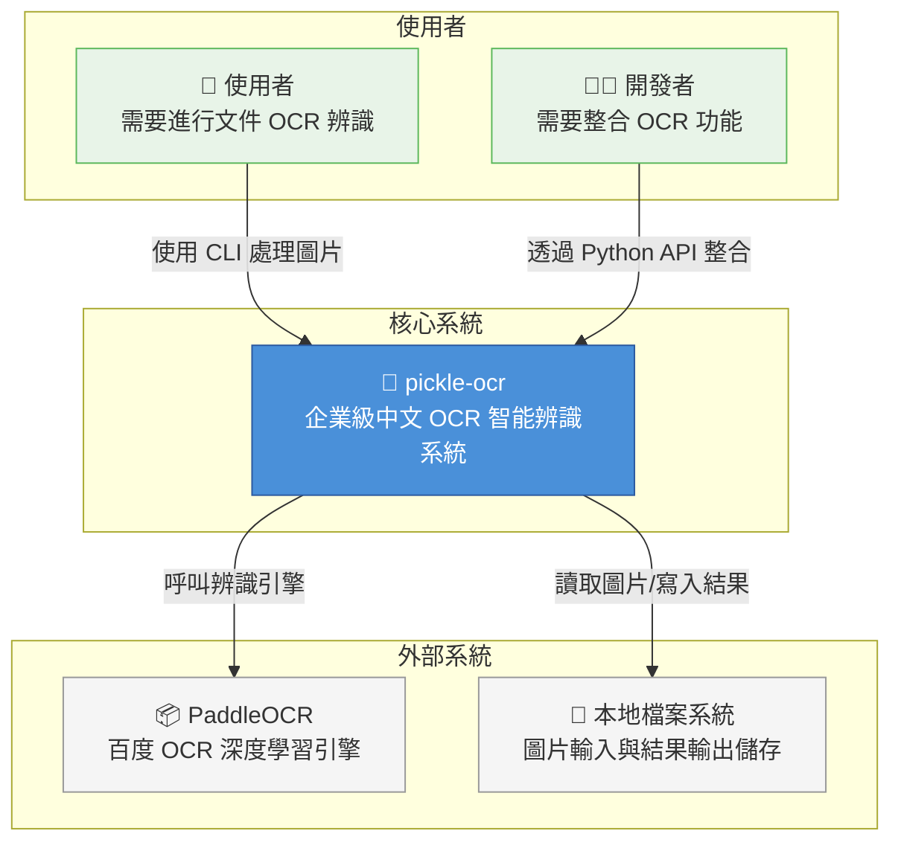
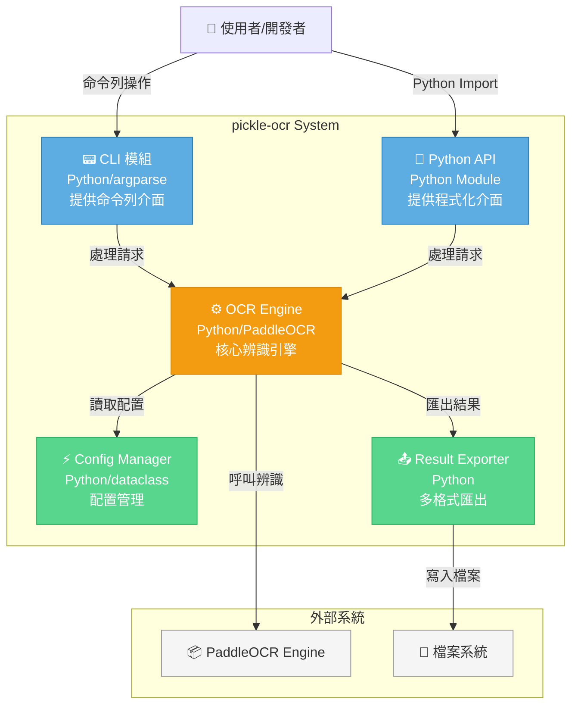
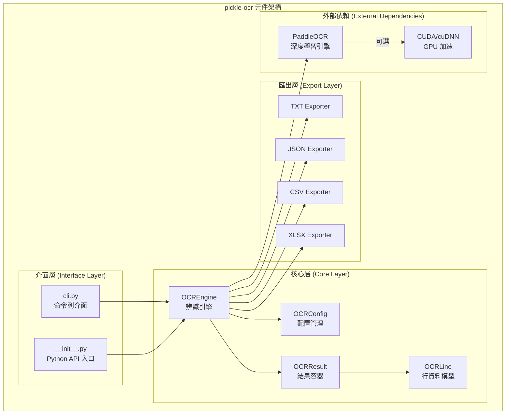
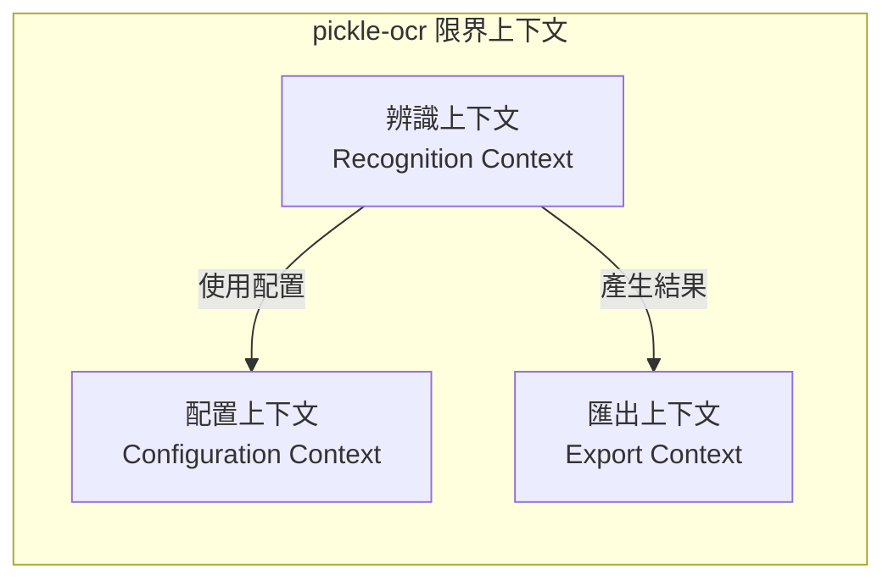
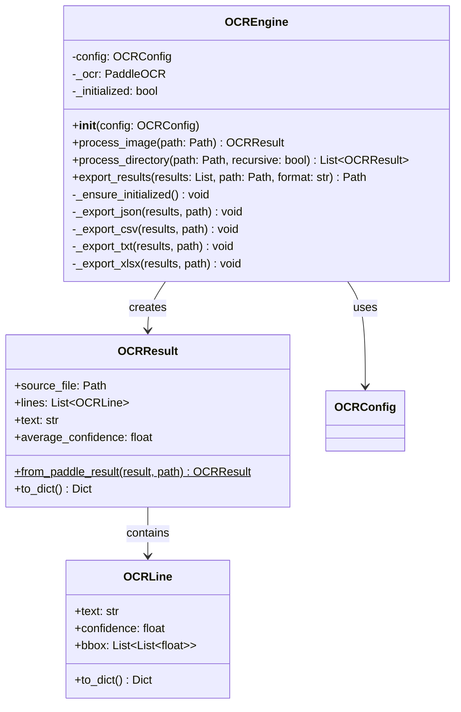
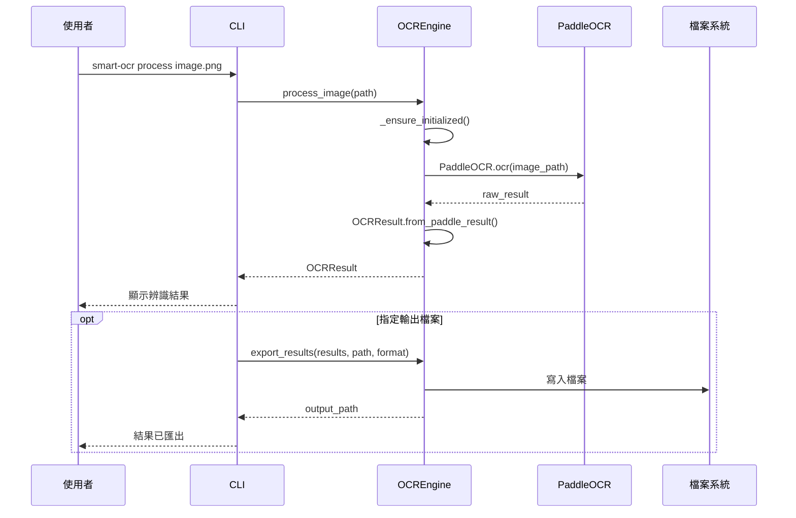
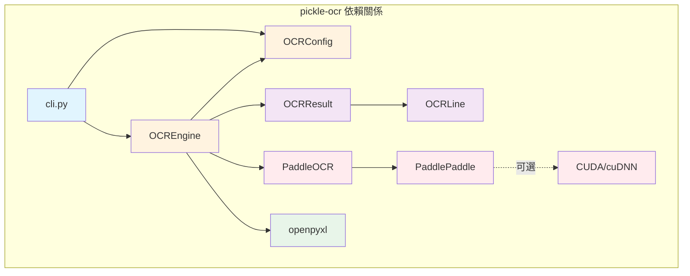

# 整合性架構與設計文件 (Unified Architecture & Design Document) - pickle-ocr

graphTB

    subgraph 使用者

    User[👤 使用者`<br/>`需要進行文件 OCR 辨識]

    Developer[👨‍💻 開發者`<br/>`需要整合 OCR 功能]

    end

    subgraph 核心系統

    OCR[🔲 pickle-ocr`<br/>`企業級中文 OCR 智能辨識系統]

    end

    subgraph 外部系統

    PaddleOCR[📦 PaddleOCR`<br/>`百度 OCR 深度學習引擎]

    FileSystem[💾 本地檔案系統`<br/>`圖片輸入與結果輸出儲存]

    end

    User-->|使用 CLI 處理圖片|OCR

    Developer-->|透過 Python API 整合|OCR

    OCR-->|呼叫辨識引擎|PaddleOCR

    OCR-->|讀取圖片/寫入結果|FileSystem

    styleOCRfill:#4a90d9,stroke:#2c5aa0,color:#fff

    stylePaddleOCRfill:#f5f5f5,stroke:#999

    styleFileSystemfill:#f5f5f5,stroke:#999

    styleUserfill:#e8f4e8,stroke:#5cb85c

    styleDeveloperfill:#e8f4e8,stroke:#5cb85

---

**文件版本 (Document Version):** `v1.0`
**最後更新 (Last Updated):** `2025-12-19`
**主要作者 (Lead Author):** Kuan-Wei
**審核者 (Reviewers):** Kuan-Wei
**狀態 (Status):** `已批准 (Approved)`

---

## 目錄 (Table of Contents)

- [第 1 部分：架構總覽 (Architecture Overview)](#第-1-部分架構總覽-architecture-overview)
  - [1.1 C4 模型：視覺化架構](#11-c4-模型視覺化架構)
  - [1.2 領域模型與通用語言](#12-領域模型與通用語言)
  - [1.3 Clean Architecture 分層](#13-clean-architecture-分層)
  - [1.4 技術選型與決策](#14-技術選型與決策)
- [第 2 部分：詳細設計 (Detailed Design)](#第-2-部分詳細設計-detailed-design)
  - [2.1 MVP 與模組優先級](#21-mvp-與模組優先級-mvp--module-priority)
  - [2.2 核心功能：模組設計](#22-核心功能模組設計)
  - [2.3 非功能性需求設計](#23-非功能性需求設計-nfrs-design)
- [第 3 部分：附錄 (Appendix)](#第-3-部分附錄-appendix)

---

**目的**: 本文件旨在將 pickle-ocr 專案的業務需求轉化為完整、內聚的技術藍圖。從高層次的系統架構開始，逐步深入到具體的模組級實現細節，確保系統的穩固性與可維護性。

---

## 第 1 部分：架構總覽 (Architecture Overview)

*此部分關注系統的宏觀結構與指導原則，回答「系統由什麼組成？」以及「它們之間如何互動？」。*

### 1.1 C4 模型：視覺化架構

#### L1 - 系統情境圖 (System Context Diagram)

*描述 pickle-ocr 系統與外部使用者/系統的互動。*



**說明：**

- **使用者**：透過命令列介面 (CLI) 與系統互動，處理單一圖片或批量資料夾
- **開發者**：透過 Python API 將 OCR 功能整合至現有專案
- **PaddleOCR**：底層深度學習 OCR 引擎，負責實際的文字辨識工作
- **本地檔案系統**：提供圖片輸入來源與辨識結果輸出儲存

#### L2 - 容器圖 (Container Diagram)

*描述系統由哪些可部署單元組成。*



#### L3 - 元件圖 (Component Diagram)

*針對核心容器，拆解其內部的模組或元件。*



### 1.2 領域模型與通用語言

#### 通用語言 (Ubiquitous Language)

| 術語                                  | 定義                                     | 範例                                              |
| ------------------------------------- | ---------------------------------------- | ------------------------------------------------- |
| **OCREngine**                   | 核心辨識引擎，負責協調整個 OCR 處理流程  | `engine = OCREngine(config)`                    |
| **OCRConfig**                   | 配置物件，包含所有可調整的辨識參數       | `OCRConfig.for_chinese()`                       |
| **OCRResult**                   | 單一圖片的辨識結果容器，包含所有辨識行   | `result.text`, `result.average_confidence`    |
| **OCRLine**                     | 單一行辨識結果，包含文字、信心分數、座標 | `line.text`, `line.confidence`, `line.bbox` |
| **信心分數 (Confidence)**       | 辨識準確度指標，0.0 ~ 1.0 之間           | `0.95` 表示 95% 信心                            |
| **座標框 (BBox)**               | 文字區域的四角座標，用於定位文字位置     | `[[x1,y1], [x2,y2], [x3,y3], [x4,y4]]`          |
| **批量處理 (Batch Processing)** | 一次處理整個資料夾的所有圖片             | `engine.process_directory(path)`                |
| **遞迴處理 (Recursive)**        | 包含子資料夾的批量處理模式               | `--recursive` 或 `-r`                         |

#### 限界上下文 (Bounded Contexts)

本專案為單體應用，主要包含以下上下文：



| 上下文               | 職責                                       | 核心類別                                  |
| -------------------- | ------------------------------------------ | ----------------------------------------- |
| **辨識上下文** | 處理圖片輸入、呼叫 PaddleOCR、產生辨識結果 | `OCREngine`, `OCRResult`, `OCRLine` |
| **配置上下文** | 管理辨識參數、語言設定、GPU 設定           | `OCRConfig`                             |
| **匯出上下文** | 將辨識結果轉換為不同格式輸出               | `export_*` 方法                         |

### 1.3 Clean Architecture 分層

*pickle-ocr 遵循 Clean Architecture 原則，確保關注點分離。*

```
┌─────────────────────────────────────────────────────────────┐
│                    介面層 (Interface Layer)                   │
│  ┌──────────────────┐  ┌──────────────────────────────────┐ │
│  │   CLI (cli.py)   │  │  Python API (__init__.py)        │ │
│  │  - argparse      │  │  - 公開 OCREngine, OCRConfig     │ │
│  │  - 命令處理      │  │  - 公開 OCRResult                │ │
│  └──────────────────┘  └──────────────────────────────────┘ │
├─────────────────────────────────────────────────────────────┤
│                   應用層 (Application Layer)                  │
│  ┌──────────────────────────────────────────────────────────┐│
│  │  OCREngine (ocr_engine.py)                              ││
│  │  - process_image(): 處理單一圖片                        ││
│  │  - process_directory(): 批量處理資料夾                  ││
│  │  - export_results(): 匯出辨識結果                       ││
│  └──────────────────────────────────────────────────────────┘│
├─────────────────────────────────────────────────────────────┤
│                    領域層 (Domain Layer)                      │
│  ┌────────────────┐  ┌────────────────┐  ┌────────────────┐ │
│  │   OCRConfig    │  │   OCRResult    │  │    OCRLine     │ │
│  │  - 配置參數    │  │  - 結果容器    │  │  - 行資料      │ │
│  │  - 工廠方法    │  │  - 屬性計算    │  │  - 序列化     │ │
│  └────────────────┘  └────────────────┘  └────────────────┘ │
├─────────────────────────────────────────────────────────────┤
│                  基礎設施層 (Infrastructure Layer)            │
│  ┌──────────────────┐  ┌──────────────────────────────────┐ │
│  │   PaddleOCR      │  │  檔案系統操作                    │ │
│  │  - 深度學習引擎  │  │  - 圖片讀取                      │ │
│  │  - GPU 加速      │  │  - 結果輸出 (TXT/JSON/CSV/XLSX)  │ │
│  └──────────────────┘  └──────────────────────────────────┘ │
└─────────────────────────────────────────────────────────────┘
```

**分層職責：**

| 層級                 | 職責                                           | 依賴方向       |
| -------------------- | ---------------------------------------------- | -------------- |
| **介面層**     | 處理使用者輸入，將請求轉換為應用層可理解的格式 | 向內依賴應用層 |
| **應用層**     | 協調業務流程，組合領域物件完成用例             | 向內依賴領域層 |
| **領域層**     | 定義核心業務規則與資料結構，無外部依賴         | 無依賴（核心） |
| **基礎設施層** | 實現與外部系統的互動（OCR 引擎、檔案系統）     | 被其他層使用   |

### 1.4 技術選型與決策

#### 技術選型原則

1. **本地優先 (Local-First)**：系統設計為本地執行，無需網路連線，保障資料隱私
2. **效能導向 (Performance-Oriented)**：支援 GPU 加速，優化批量處理效能
3. **易於整合 (Easy Integration)**：提供 CLI 與 Python API 雙介面
4. **開源優先 (Open-Source First)**：採用開源技術棧，降低授權成本

#### 技術棧詳情

| 分類                   | 選用技術              | 選擇理由                                 | 備選方案            | 相關決策 |
| ---------------------- | --------------------- | ---------------------------------------- | ------------------- | -------- |
| **程式語言**     | Python 3.10+          | PaddleOCR 原生支援、生態豐富、開發效率高 | -                   | D-002    |
| **OCR 引擎**     | PaddleOCR 2.9.1       | 中文辨識效果優異、開源免費、支援 GPU     | Tesseract、EasyOCR  | D-001    |
| **深度學習框架** | PaddlePaddle 2.6.2    | PaddleOCR 依賴、百度維護、效能優異       | PyTorch、TensorFlow | D-001    |
| **CLI 框架**     | argparse              | Python 內建、無額外依賴、功能完整        | Click、Typer        | D-003    |
| **配置管理**     | dataclass             | Python 內建、型別安全、易於擴展          | Pydantic            | -        |
| **Excel 匯出**   | openpyxl              | 純 Python、功能完整、活躍維護            | xlsxwriter          | -        |
| **GPU 加速**     | CUDA 11.x + cuDNN 8.x | PaddlePaddle 官方支援版本                | -                   | -        |
| **套件管理**     | uv                    | 安裝速度快、相容 pip                     | pip、poetry         | D-004    |
| **測試框架**     | pytest                | Python 社群標準、功能完整                | unittest            | -        |

#### 架構決策記錄 (ADR) 摘要

| ID              | 決策                        | 狀態   | 理由                                 |
| --------------- | --------------------------- | ------ | ------------------------------------ |
| **D-001** | 採用 PaddleOCR 作為核心引擎 | 已決定 | 中文辨識效果優於 Tesseract、免費開源 |
| **D-002** | 使用 Python 作為開發語言    | 已決定 | 深度學習生態完整、開發效率高         |
| **D-003** | CLI 採用 argparse           | 已決定 | 內建模組、無額外依賴、功能足夠       |
| **D-004** | 套件管理採用 uv             | 已決定 | 安裝速度快、相容現有 pip 生態        |

---

## 第 2 部分：詳細設計 (Detailed Design)

*此部分關注具體模組的實現細節，回答「每個部分如何工作？」。*

### 2.1 MVP 與模組優先級 (MVP & Module Priority)

*根據 [PRD](./project_brief_and_prd.md) 中的使用者故事，定義最小可行產品 (MVP) 的範圍。*

#### MVP 範圍 (Phase 1)

| 優先級 | 模組          | 對應 User Story        | 狀態    |
| ------ | ------------- | ---------------------- | ------- |
| P0     | 單一圖片辨識  | US-001                 | ✅ 完成 |
| P0     | 配置管理      | US-009                 | ✅ 完成 |
| P0     | TXT/JSON 匯出 | US-002, US-006         | ✅ 完成 |
| P1     | CLI 介面      | US-001, US-002, US-003 | ✅ 完成 |
| P1     | 批量處理      | US-004, US-005         | ✅ 完成 |
| P1     | CSV/XLSX 匯出 | US-007                 | ✅ 完成 |
| P1     | GPU 加速      | US-003                 | ✅ 完成 |
| P2     | Python API    | US-008, US-009         | ✅ 完成 |

#### 後續功能 (Post-MVP)

| 優先級 | 功能          | 對應問題 | 狀態   |
| ------ | ------------- | -------- | ------ |
| P3     | 自訂模型匯入  | Q-001    | 待討論 |
| P3     | 版面分析      | Q-002    | 待討論 |
| P3     | Docker 映像檔 | Q-003    | 待討論 |

### 2.2 核心功能：模組設計

#### 模組：OCRConfig (配置管理)

**職責**：管理所有 OCR 辨識相關的配置參數

**資料模型**：

```python
@dataclass
class OCRConfig:
    # 語言設定
    lang: str = "ch"              # 辨識語言 (ch/en)
    use_angle_cls: bool = True    # 文字方向分類

    # 效能設定
    use_gpu: bool = False         # GPU 加速
    gpu_mem: int = 500            # GPU 記憶體限制 (MB)
    cpu_threads: int = 10         # CPU 執行緒數

    # 偵測設定
    det_algorithm: str = "DB"     # 偵測演算法
    det_db_thresh: float = 0.3    # 偵測閾值
    det_db_box_thresh: float = 0.6

    # 輸出設定
    output_dir: Path              # 輸出目錄
    export_formats: List[str]     # 支援的匯出格式
```

**工廠方法**：

| 方法              | 用途           | 特殊配置                              |
| ----------------- | -------------- | ------------------------------------- |
| `for_chinese()` | 中文優化配置   | 啟用角度分類、調整偵測閾值            |
| `for_english()` | 英文優化配置   | 停用角度分類                          |
| `from_env()`    | 從環境變數讀取 | 支援 `OCR_LANG`, `OCR_USE_GPU` 等 |

#### 模組：OCREngine (辨識引擎)

**職責**：核心辨識引擎，協調整個 OCR 處理流程

**類別圖**：



**核心流程**：



**關鍵演算法**：

1. **延遲初始化 (Lazy Initialization)**：

   - PaddleOCR 引擎在首次使用時才初始化
   - 避免載入時的長時間等待
   - GPU 環境設定在初始化時處理
2. **PaddleOCR 結果解析**：

   ```python
   # PaddleOCR 2.x 輸出格式
   result = [
       [  # 頁面結果
           [bbox, (text, confidence)],
           [bbox, (text, confidence)],
           ...
       ]
   ]
   # 解析為 OCRLine 物件列表
   ```

#### 模組：CLI (命令列介面)

**職責**：提供使用者友善的命令列介面

**命令結構**：

```
smart-ocr
├── --version, -v       # 顯示版本資訊
├── process             # 處理圖片命令
│   ├── input           # 輸入圖片或資料夾 (必要)
│   ├── --output, -o    # 輸出檔案路徑
│   ├── --format, -f    # 輸出格式 (txt/json/csv/xlsx)
│   ├── --lang, -l      # 辨識語言 (ch/en)
│   ├── --gpu           # 啟用 GPU 加速
│   ├── --recursive, -r # 遞迴處理
│   └── --quiet, -q     # 靜默模式
└── config              # 配置命令
    └── --show          # 顯示目前配置
```

**使用範例**：

```bash
# 處理單一圖片
smart-ocr process image.png

# 批量處理資料夾 (遞迴 + GPU + JSON 輸出)
smart-ocr process ./documents/ -r --gpu -o results.json -f json

# 查看目前配置
smart-ocr config --show
```

### 2.3 非功能性需求設計 (NFRs Design)

*描述如何實現 PRD 中定義的非功能性需求。*

#### 性能 (Performance)

| 需求                | 設計決策                | 實現方式                     |
| ------------------- | ----------------------- | ---------------------------- |
| 單張圖片 CPU < 3 秒 | 使用 PaddleOCR 優化模型 | 預設使用 SVTR_LCNet 辨識模型 |
| 單張圖片 GPU < 1 秒 | 支援 CUDA 加速          | 自動設定 CUDA/cuDNN 環境     |
| 記憶體 < 2GB        | 延遲初始化 + 串流處理   | 逐一處理圖片，不預載全部     |

#### 可靠性 (Reliability)

| 需求         | 設計決策               | 實現方式                    |
| ------------ | ---------------------- | --------------------------- |
| 批量處理容錯 | 單一檔案失敗不中斷整體 | try-except 包裝每張圖片處理 |
| 錯誤記錄     | 詳細的日誌輸出         | 使用 logging 模組記錄錯誤   |
| 輸入驗證     | 提前驗證檔案存在性     | 處理前檢查路徑有效性        |

#### 可維護性 (Maintainability)

| 需求               | 設計決策       | 實現方式                     |
| ------------------ | -------------- | ---------------------------- |
| 程式碼覆蓋率 > 80% | 完整的單元測試 | pytest + 測試固件 (fixtures) |
| 符合 PEP 8         | 程式碼風格檢查 | black + isort + flake8       |
| 完整 Type Hints    | 靜態型別檢查   | mypy + 型別標註              |

#### 可用性 (Usability)

| 需求           | 設計決策             | 實現方式                |
| -------------- | -------------------- | ----------------------- |
| 清晰的錯誤訊息 | 使用者友善的例外處理 | 自訂錯誤類別 + 詳細說明 |
| 處理進度顯示   | 批量處理時顯示進度   | 輸出處理的檔案數量      |
| UTF-8 支援     | Windows 終端機相容   | 自動設定 stdout 編碼    |

---

## 第 3 部分：附錄 (Appendix)

### 3.1 專案目錄結構

```
pickle-ocr/
├── src/smart_ocr/           # 原始碼
│   ├── __init__.py          # 套件初始化 + Python API 入口
│   ├── cli.py               # 命令列介面
│   └── core/
│       ├── __init__.py
│       ├── config.py        # OCRConfig 配置管理
│       └── ocr_engine.py    # OCREngine, OCRResult, OCRLine
├── tests/                   # 測試套件
│   ├── unit/                # 單元測試
│   │   ├── test_config.py
│   │   └── test_ocr_engine.py
│   ├── integration/         # 整合測試
│   │   └── test_cli.py
│   └── conftest.py          # 共用 fixtures
├── docs/                    # 文件
│   ├── project_brief_and_prd.md
│   └── architecture_and_design_document.md
├── output/                  # 預設輸出目錄
├── pyproject.toml           # 專案配置
├── CLAUDE.md                # 開發規則
└── README.md                # 專案說明
```

### 3.2 依賴關係圖



### 3.3 環境變數支援

| 變數名稱           | 說明                          | 預設值     |
| ------------------ | ----------------------------- | ---------- |
| `OCR_LANG`       | 辨識語言                      | `ch`     |
| `OCR_USE_GPU`    | 啟用 GPU (`true`/`false`) | `false`  |
| `OCR_OUTPUT_DIR` | 輸出目錄                      | `output` |

### 3.4 匯出格式規格

#### TXT 格式

```
=== 文件1.png ===
這是辨識出來的文字內容
第二行文字

=== 文件2.png ===
另一個文件的內容
```

#### JSON 格式

```json
[
  {
    "source_file": "文件1.png",
    "text": "這是辨識出來的文字內容\n第二行文字",
    "average_confidence": 0.95,
    "lines": [
      {
        "text": "這是辨識出來的文字內容",
        "confidence": 0.96,
        "bbox": [[10, 10], [200, 10], [200, 30], [10, 30]]
      }
    ]
  }
]
```

#### CSV 格式

| file      | text                   | confidence | bbox          |
| --------- | ---------------------- | ---------- | ------------- |
| 文件1.png | 這是辨識出來的文字內容 | 0.96       | [[10,10],...] |

#### XLSX 格式

| 檔案      | 行號 | 文字內容               | 信心分數 | 座標          |
| --------- | ---- | ---------------------- | -------- | ------------- |
| 文件1.png | 1    | 這是辨識出來的文字內容 | 96.00%   | [[10,10],...] |

---

**文件審核記錄 (Review History):**

| 日期       | 審核人   | 版本 | 變更摘要/主要反饋                   |
| :--------- | :------- | :--- | :---------------------------------- |
| 2025-12-19 | Kuan-Wei | v1.0 | 初版建立，根據 PRD 與程式碼結構整理 |
